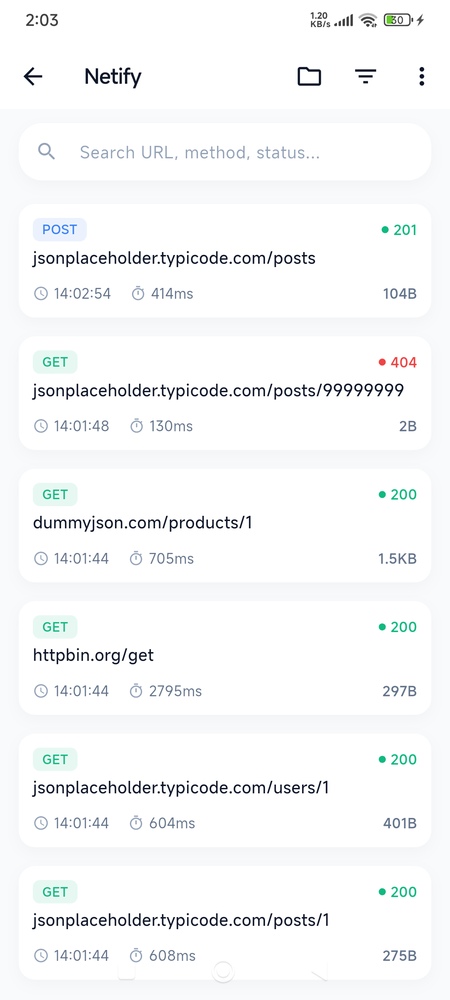
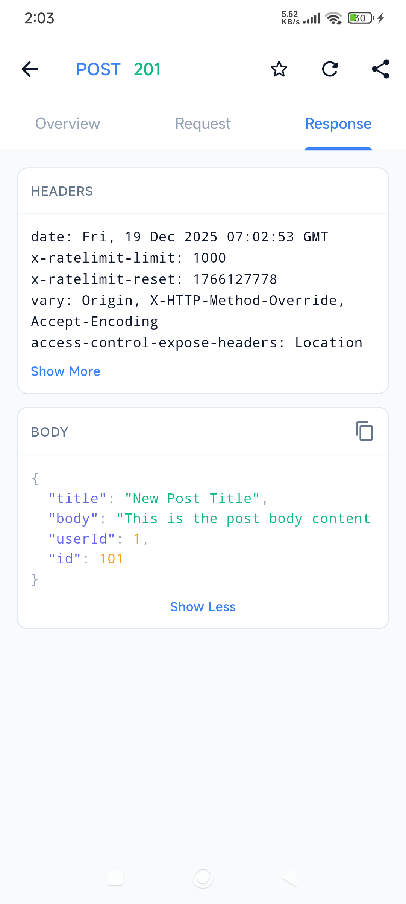
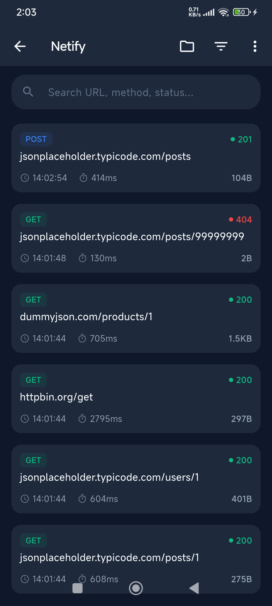
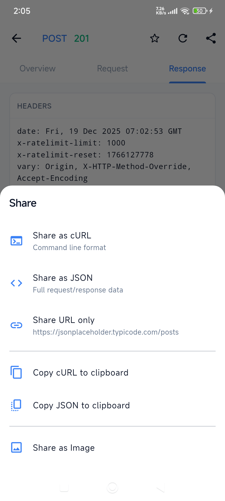

# Netify for Flutter

**Universal network inspector for Flutter apps.** Supports multiple HTTP clients with beautiful in-app debugging UI.

[](https://pub.dev/packages/netify_core)
[](https://opensource.org/licenses/MIT)
[](https://github.com/netify-app/netify-flutter)

---

## 🎯 What is Netify?

Netify is a **universal network debugging tool** for Flutter that works with multiple HTTP clients. It provides a beautiful in-app UI for inspecting network requests, with support for callbacks, filters, and production monitoring integrations.

### **Why Netify?**

- 🌍 **Multi-Client Support** - Works with Dio, HTTP package, GraphQL, and more
- 🎨 **Beautiful UI** - Modern interface with dark mode
- ⚡ **Zero Setup** - 2-line integration
- 🔄 **Dual Mode** - Debug UI + Production monitoring
- 🪶 **Zero Bloat** - Install only what you need

---

## 📦 Packages

This repository contains multiple packages using a monorepo structure:

| Package                                       | Version | Description                          | pub.dev                                                                                      |
| --------------------------------------------- | ------- | ------------------------------------ | -------------------------------------------------------------------------------------------- |
| **[netify_core](packages/netify_core)**       | 3.0.0   | Core functionality (client-agnostic) | [](https://pub.dev/packages/netify_core) |
| **[netify_dio](packages/netify_dio)**         | 3.0.0   | Dio HTTP client adapter              | [](https://pub.dev/packages/netify_dio)   |
| **[netify_http](packages/netify_http)**       | 3.0.0   | HTTP package adapter                 | [](https://pub.dev/packages/netify_http) |
| **[netify_graphql](packages/netify_graphql)** | -       | GraphQL adapter                      | 🚧 Coming soon                                                                               |

---

## 🚀 Quick Start

### For Dio Users

```yaml
dependencies:
  netify_dio: ^3.0.0
  dio: ^5.4.0
```

```dart
import 'package:netify_dio/netify_dio.dart';

void main() async {
  final dio = Dio();
  await NetifyDio.init(dio: dio);

  runApp(MyApp());
}

class MyApp extends StatelessWidget {
  @override
  Widget build(BuildContext context) {
    return MaterialApp(
      navigatorKey: NetifyDio.navigatorKey, // Required for bubble UI
      home: HomePage(),
    );
  }
}
```

### For HTTP Package Users

```yaml
dependencies:
  netify_http: ^3.0.0
  http: ^1.1.0
```

```dart
import 'package:netify_http/netify_http.dart';

void main() async {
  final client = http.Client();
  await NetifyHttp.init(client: client);

  runApp(MyApp());
}

// Use NetifyHttp.client for all requests
final response = await NetifyHttp.client.get(
  Uri.parse('https://api.example.com/users'),
);
```

---

## ✨ Features

### **Debug Mode** (Development)

- 📡 **Network Inspection** - Capture all HTTP requests/responses
- 🫧 **Floating Bubble** - Draggable overlay with request count
- 🌙 **Dark Mode** - Beautiful UI in light and dark themes
- 📸 **Share as Image** - Export request details as images
- 🔄 **Request Replay** - Re-send any captured request
- 🔍 **Search & Filter** - Find requests quickly
- ⭐ **Favorites** - Mark important requests
- 📤 **Export** - JSON, HAR, cURL formats

### **Production Mode** (Optional)

- 📊 **Monitoring** - Lightweight request tracking
- 🔌 **Integrations** - Sentry, Firebase, Datadog, custom webhooks
- 🎯 **Smart Filters** - Capture only what matters
- 🔒 **Privacy** - PII detection and redaction
- ⚡ **Zero Overhead** - Minimal performance impact

---

## 📚 Documentation

- **Website**: [netify.dev](https://netify.dev) (coming soon)
- **Getting Started**: [docs/getting-started.md](docs/getting-started.md)
- **API Reference**: [docs/api-reference.md](docs/api-reference.md)
- **Architecture**: [ARCHITECTURE.md](ARCHITECTURE.md)
- **Migration Guide**: [docs/migration-v2-to-v3.md](docs/migration-v2-to-v3.md)

### **Package Documentation**

- [netify_core README](packages/netify_core/README.md)
- [netify_dio README](packages/netify_dio/README.md)
- [netify_http README](packages/netify_http/README.md)

---

## 🎨 Screenshots

| Logs List                          | Log Detail                            | Dark Mode                          | Share                               |
| ---------------------------------- | ------------------------------------- | ---------------------------------- | ----------------------------------- |
|  |  |  |  |

---

## 🔧 Advanced Usage

### With Callbacks

```dart
await NetifyDio.init(
  dio: dio,
  config: NetifyConfig(
    callbacks: NetifyCallbacks(
      onRequest: (log) => print('Request: ${log.url}'),
      onResponse: (log) => print('Response: ${log.statusCode}'),
      onError: (log) => yourAnalytics.trackError(log),
      onSlowRequest: (log, threshold) => yourMonitoring.alert(log),
    ),
  ),
);
```

### With Filters

```dart
await NetifyDio.init(
  dio: dio,
  config: NetifyConfig(
    filters: NetifyFilters(
      captureStatusCodes: [400, 401, 403, 404, 500],
      captureSlowRequests: Duration(seconds: 3),
      ignorePaths: ['/health', '/metrics'],
      ignoreHosts: ['analytics.example.com'],
    ),
  ),
);
```

### Export & Replay

```dart
// Export as JSON
final json = NetifyDio.exportAsJson();

// Export as HAR (HTTP Archive)
final har = NetifyDio.exportAsHar();

// Generate cURL command
final curl = NetifyDio.generateCurl(log);

// Replay a request
await NetifyDio.replayRequest(log);
```

---

## 🏗️ Architecture

Netify uses a **modular adapter pattern** to support multiple HTTP clients:

```
┌─────────────────────────────────────────┐
│         netify_core                      │
│  - NetworkLog (universal data model)    │
│  - LogRepository                         │
│  - UI Components (NetifyPanel, etc.)    │
│  - Callbacks & Filters                   │
└─────────────────────────────────────────┘
                    ▲
                    │
        ┌───────────┴───────────┐
        │                       │
┌───────┴────────┐    ┌────────┴────────┐
│  netify_dio    │    │  netify_http    │
│  (Dio adapter) │    │  (http adapter) │
└────────────────┘    └─────────────────┘
```

**Benefits**:

- ✅ Zero dependency bloat - install only what you need
- ✅ Easy to extend - add new HTTP clients via adapters
- ✅ Type-safe - each adapter handles client-specific types
- ✅ Maintainable - core logic separated from client code

See [ARCHITECTURE.md](ARCHITECTURE.md) for details.

---

## 🤝 Contributing

We welcome contributions! See [CONTRIBUTING.md](CONTRIBUTING.md) for guidelines.

### Development Setup

```bash
# Clone the repository
git clone https://github.com/netify-app/netify-flutter.git
cd netify-flutter

# Install melos for monorepo management
dart pub global activate melos

# Bootstrap all packages
melos bootstrap

# Run tests
melos test

# Run analysis
melos analyze
```

---

## 📝 Changelog

See [CHANGELOG.md](CHANGELOG.md) for version history.

### Latest Release: v3.0.0

- 🎉 Multi-client architecture
- ✅ Support for Dio, HTTP package
- ✅ Callbacks & filters system
- ✅ Export as JSON/HAR
- ✅ Request replay functionality

---

## 📄 License

MIT License - see [LICENSE](LICENSE) for details.

---

## 🙏 Acknowledgments

Built with ❤️ by [@ricoerlan](https://github.com/ricoerlan) and [contributors](https://github.com/netify-app/netify-flutter/graphs/contributors).

Inspired by:

- Chrome DevTools
- Alice (Flutter)
- Chucker (Android)
- Netfox (iOS)

---

## 🔗 Links

- **Organization**: [github.com/netify-app](https://github.com/netify-app)
- **Website**: [netify.dev](https://netify.dev) (coming soon)
- **Issues**: [github.com/netify-app/netify-flutter/issues](https://github.com/netify-app/netify-flutter/issues)
- **Discussions**: [github.com/netify-app/netify-flutter/discussions](https://github.com/netify-app/netify-flutter/discussions)

---

<div align="center">

**[⭐ Star us on GitHub](https://github.com/netify-app/netify-flutter)** • **[📖 Read the Docs](https://netify.dev)** • **[💬 Join Discussions](https://github.com/netify-app/netify-flutter/discussions)**

Made with ❤️ for Flutter developers

</div>
